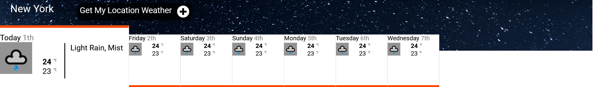

## Table of contents

- [Overview](#overview)
  - [The challenge](#the-challenge)
  - [Screenshot](#screenshot)
  - [Links](#links)
- [My process](#my-process)
  - [Built with](#built-with)
  - [What I learned](#what-i-learned)
  - [Useful resources](#useful-resources)
- [Author](#author)
- [Acknowledgments](#acknowledgments)

## Overview

### The challenge

Users should be able to:

- See date and weather for the whole week of a default state (New-York)
- Navigate between the different days and see more details on the weather
- Press on get my location to get the weather for the users' location

### Screenshot

### Links

- Live Site URL: [Live](https://stupefied-almeida-475fe8.netlify.app/)

## My process

### Built with

- CSS custom properties
- Flexbox
- [React](https://reactjs.org/) - JS library
- [Styled Components](https://styled-components.com/) - For styles

-For testing I used Storybook and Jest.

### What I learned

I learned that most weather APIS want money for more than the most basic service. lol.

### Useful resources

- [Weather API](https://weatherstack.com/) - It's a nice API and they have really good docs.
- [Location API](https://positionstack.com) - It's an API from the same company as above.

## Author

- LinkedIn - [@Nitsan Cohen](https://www.linkedin.com/in/nitsan-cohen/)

## Acknowledgments

Thanks for the PI staff for letting me do this interesting task and also for just being really nice :)
